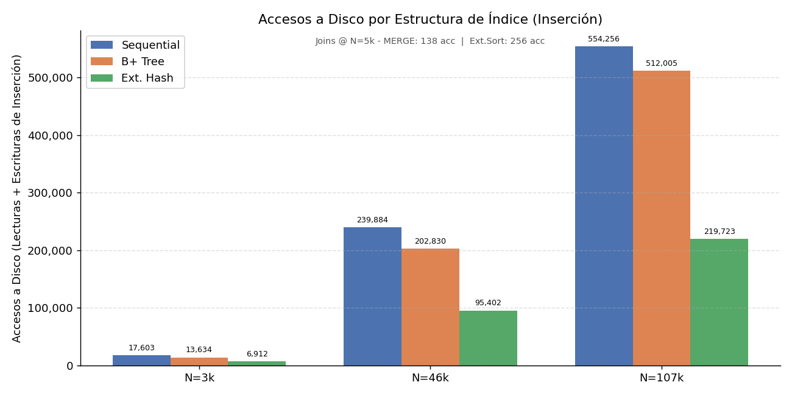
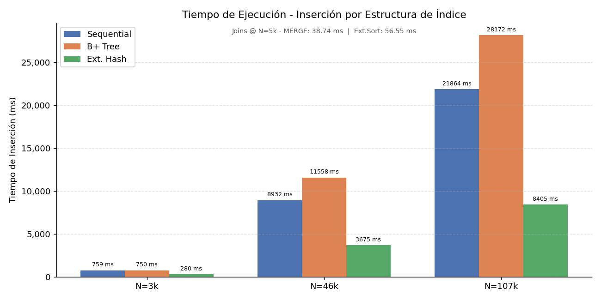
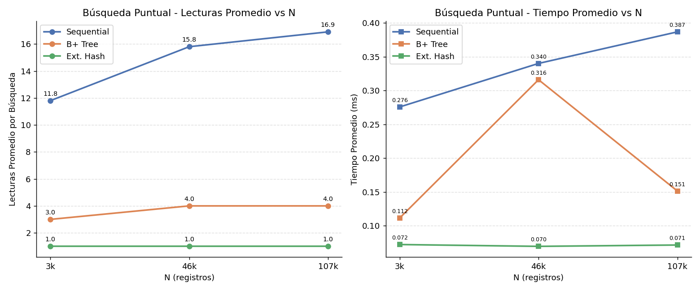
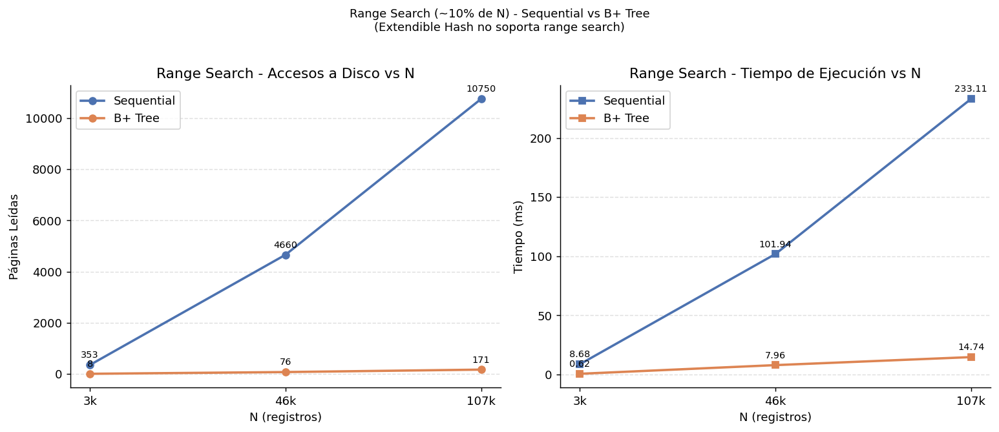
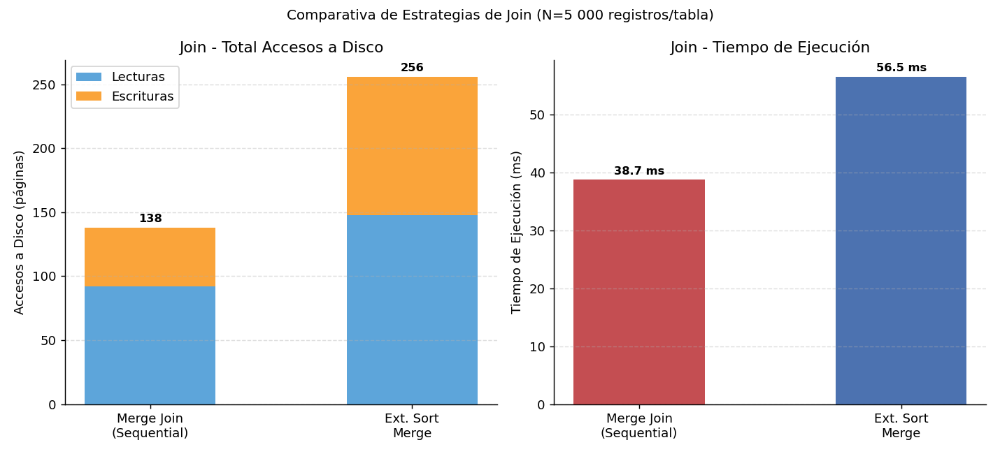

# Informe Técnico: JupiterDB — Simulador de SGBD Paginado (4 KB)

**Curso:** Base de Datos 2 · UTEC · Ciclo 2026-1  

---

## 1. Introducción y Objetivo

JupiterDB es un mini-gestor de bases de datos implementado íntegramente en Python que opera sobre memoria secundaria con acceso estrictamente paginado (bloques de 4 096 bytes). Ninguna operación carga el archivo completo en RAM; toda lectura y escritura pasa por `DiskController`, que contabiliza cada acceso mediante el singleton `Telemetry`.

El sistema integra: (i) cuatro estructuras de indexación sobre disco (Sequential File, Extendible Hashing, B+ Tree, R-Tree), (ii) un parser SQL de descendente recursivo con soporte espacial, (iii) un simulador de control de concurrencia con bloqueos a nivel de página y detección de interbloqueos, y (iv) una interfaz gráfica Tkinter con visualización espacial interactiva.

---

## 2. Estructuras de Indexación

### 2.1. Sequential File

El archivo principal mantiene registros ordenados por clave. Las inserciones se dirigen a un **archivo de desbordamiento (overflow)** sin ordenar; cuando el overflow alcanza `K_threshold` registros, se dispara una **reorganización física** que fusiona ambos archivos, re-ordena y reescribe el principal.

**Operaciones:**

| Operación | Algoritmo | Coste en páginas |
| :--- | :--- | :--- |
| `search(k)` | Búsqueda binaria en main + escaneo lineal en overflow | O(log(N/B) + K/B) |
| `add(r)` | Append en overflow; reorganize si `|overflow| >= K` | O(1) amortizado |
| `rangeSearch(lo, hi)` | Localiza `lo` por binaria, escanea forward + overflow | O(log(N/B) + result/B) |
| `remove(k)` | Marca lógica + reescritura de página | O(log(N/B)) |

**Estructura en disco:**

```
seq_main.bin:
  [Header: Page 0 -> n_records (4B)]
  [Page 1 .. Page ceil(N/RPP) -> registros ordenados por clave]

seq_overflow.bin:
  [Header: Page 0 -> n_records (4B)]
  [Page 1 .. -> registros sin orden (append-only)]
```

La búsqueda binaria opera sobre páginas: descarta mitades enteras leyendo una sola página por paso, alcanzando el rango objetivo en `ceil(log2(N/RPP))` accesos.

---

### 2.2. Extendible Hashing

Implementa un **directorio dinámico** con profundidad global `d` (máx. 24). El directorio tiene `2^d` entradas; cada entrada apunta a una página bucket de capacidad fija `bucket_cap`. La función de hash es CRC-32 truncada a `d` bits.

**Operaciones:**

| Operación | Algoritmo | Coste en páginas |
| :--- | :--- | :--- |
| `search(k)` | `hash(k, d)` -> directorio -> bucket scan | **O(1)** — exactamente 1 lectura |
| `add(r)` | Hash + append; si bucket lleno -> split local + posible duplicación de directorio | O(1) amortizado |
| `remove(k)` | Hash + scan + reescritura del bucket | O(1) |

**Split de bucket:** cuando un bucket con profundidad local `l` se desborda, se crea un nuevo bucket con `l+1`; los registros se redistribuyen según el bit `l` de su hash. Si `l = d`, se duplica el directorio (`d -> d+1`).

**Estructura en disco:**

```
hash.bin:
  [Blocks 0..2^d-1 -> bucket pages]
  [Cada bucket: Header(local_depth u32, n_records u32) | records...]

hash.dir:
  [Metadata: global_depth, n_buckets, block_ids[]]
```

El directorio se persiste en un archivo `.dir` separado para evitar reescribir el archivo de buckets completo al duplicar.

---

### 2.3. B+ Tree

Árbol balanceado con nodos de tamaño fijo (una página = 4 096 B). Las hojas contienen los **registros reales** (índice *clustered*); los nodos internos sólo almacenan claves de separación y punteros a hijos.

```
Root (Internal) · Page 0
  |-- Internal · Page 1
  |     |-- Leaf · Page 3  [rec1 rec2 ... rec_t]  <--> Leaf · Page 4 <--> ...
  |     `-- Leaf · Page 4
  `-- Internal · Page 2
        |-- Leaf · Page 5
        `-- Leaf · Page 6
```

**Capacidades** (PAGE_SIZE = 4 096 B, record = 32 B):
- `leaf_cap` = 127 registros/hoja
- `internal_cap` = 340 claves/nodo

| Operación | Coste (páginas) |
| :--- | :--- |
| `search(k)` | `ceil(log_127(N))` — una página por nivel |
| `add(r)` | `ceil(log(N))` descendiendo + O(h) splits (amortizado O(log N)) |
| `rangeSearch(lo, hi)` | `ceil(log(N))` + `ceil(result / 127)` hojas encadenadas |
| `remove(k)` | `ceil(log(N))` — marca lógica sin rebalanceo |

**Split:** al desbordarse una hoja, se crea hoja nueva, se promueve la clave mediana al padre y se actualiza el enlace `next_leaf`. El split se propaga hacia arriba (`_push_up`) hasta el nivel donde haya espacio o hasta crear una nueva raíz.

---

### 2.4. R-Tree (Índice Espacial)

Árbol de altura balanceada para datos 2D. Cada nodo interno almacena **MBR** (Minimum Bounding Rectangles) de sus hijos; las hojas almacenan puntos `(x, y, record_id)`.

**Quadratic Split:** al desbordarse un nodo, el algoritmo `_quadratic_split` elige las dos entradas más alejadas como semillas (*PickSeeds*) y luego asigna cada entrada restante al grupo cuyo MBR crece menos (*PickNext*).

| Operación | Algoritmo | Complejidad |
| :--- | :--- | :--- |
| `spatial_query(cx, cy, r)` | DFS con poda: salta nodos cuyo `mindist(MBR, query_point) > r` | O(sqrt(N)) esperado |
| `knn_query(qx, qy, k)` | Best-First con min-heap; expande nodo con menor `mindist` | O((k + log N) log N) |
| `add(point, id)` | `choose_leaf` (min área-enlargement) + `adjust_tree` | O(log N) |
| `remove(k)` | Scan de hojas + condense tree | O(N) peor caso |

La visualización gráfica (GUI) dibuja todos los puntos del índice sobre un canvas Tkinter con zoom/pan, círculo de radio para consultas espaciales y conectores numerados para KNN.

---

### 2.5. External Sort — TPMMS

El `ExternalSorter` implementa **Two-Pass Multi-way Merge Sort**, usado internamente para el `EXTERNAL_SORT_MERGE` join.

```
Fase 1 — Generación de Runs:
  Disco -> RAM (Buffer): Lee run_size_pages páginas
  RAM -> RAM: Quicksort en memoria
  RAM -> Disco: Escribe Run_i.run (ordenado)

Fase 2 — Mezcla k-vías:
  Disco -> RAM: Lee 1 página de cada Run_i
  RAM -> RAM: Min-Heap: extrae mínimo global
  RAM -> Disco: Escribe página de salida ordenada
```

Coste teórico: `2 * ceil(N/B) * 2` accesos (leer + escribir x 2 fases) donde `B` = páginas en buffer.

---

## 3. Análisis Teórico de Complejidad

### 3.1. Tabla Comparativa

| Operación | Sequential File | B+ Tree | Extendible Hash |
| :--- | :---: | :---: | :---: |
| Búsqueda puntual | O(log(N/B) + K/B) | **O(log_t N)** | **O(1)** |
| Inserción | O(1) amort. | O(log_t N) amort. | **O(1)** amort. |
| Range search | O(log(N/B) + R/B) | O(log_t N + R/t) | — no soportado — |
| Borrado | O(log(N/B)) | O(log_t N) | O(1) |

Amortizado: O(N/B) por reorganización, pero con frecuencia 1/K.
B = registros por página, t = capacidad de hoja/bucket, R = registros en resultado, K = umbral de overflow.

### 3.2. Derivación de Profundidades Esperadas

**B+ Tree** con `leaf_cap = 127` y `N` registros:

```
h = ceil(log_127(N)) + 1   (raiz + niveles internos + hoja)

N =      1 000  ->  h = ceil(1.43) + 1 = 3  accesos esperados
N =      5 000  ->  h = ceil(1.89) + 1 = 3
N =     10 000  ->  h = ceil(2.13) + 1 = 3-4
N =    100 000  ->  h = ceil(2.82) + 1 = 4
```

**Sequential File** con `RPP = 128` registros por página, `K_threshold = N/20`:

```
Búsqueda binaria accesos = ceil(log2(N / RPP))

N =      1 000  ->  ceil(log2(7.8))  = 3  (+ overflow scan)
N =      5 000  ->  ceil(log2(39.1)) = 6  (+ overflow scan)
N =     10 000  ->  ceil(log2(78.1)) = 7  (+ overflow scan)
N =    100 000  ->  ceil(log2(781))  = 10 (+ overflow scan)
```

**Extendible Hash**: exactamente **1 acceso de lectura** independientemente de N (directorio en memoria, bucket en disco).

---

## 4. Parser SQL

### 4.1. Arquitectura

El parser sigue un diseño clásico de tres capas:

```
Texto SQL  ->  [Lexer / Scanner]  ->  Token stream
                                           |
                                           v
                                [Recursive Descent Parser]
                                           |
                                           v
                                     AST (InstructionNode)
                                           |
                                           v
                                [StorageEngine.execute()]
```

### 4.2. Gramática Formal (EBNF)

```ebnf
program       = statement { ';' statement } [ ';' ] ;

statement     = create_stmt | select_stmt | insert_stmt | delete_stmt ;

(* CREATE *)
create_stmt   = 'CREATE' 'TABLE' IDENT '(' col_def { ',' col_def } ')'
                [ 'FROM' 'FILE' STRING ] ;
col_def       = IDENT type_spec [ 'INDEX' index_type ] ;
type_spec     = 'INTEGER' | 'BIGINT' | 'FLOAT' | 'VARCHAR' '(' INT ')' ;
index_type    = 'BTREE' | 'HASH' | 'SEQUENTIAL' | 'RTREE' ;

(* SELECT *)
select_stmt   = 'SELECT' target_list 'FROM' IDENT
                [ join_clause ] [ where_clause ] [ groupby_clause ] ;
target_list   = '*' | target { ',' target } ;
target        = agg_expr | qualified_col ;
agg_expr      = ( 'COUNT' | 'SUM' | 'AVG' | 'MIN' | 'MAX' ) '(' target ')' ;
qualified_col = IDENT [ '.' IDENT ] ;
join_clause   = 'JOIN' IDENT 'ON' qualified_col '=' qualified_col ;
groupby_clause= 'GROUP' 'BY' IDENT { ',' IDENT } ;

(* WHERE *)
where_clause  = 'WHERE' filter_expr ;
filter_expr   = simple_cond { 'AND' simple_cond } ;
simple_cond   = spatial_cond | range_cond | cmp_cond ;
spatial_cond  = '(' IDENT ',' IDENT ')' 'IN'
                '(' 'POINT' '(' number ',' number ')' ','
                    ( 'RADIUS' number | 'K' INT ) ')' ;
range_cond    = IDENT 'BETWEEN' literal 'AND' literal ;
cmp_cond      = IDENT ( '=' | '!=' | '<' | '>' | '<=' | '>=' ) literal ;

(* INSERT / DELETE *)
insert_stmt   = 'INSERT' 'INTO' IDENT 'VALUES' '(' literal { ',' literal } ')' ;
delete_stmt   = 'DELETE' 'FROM' IDENT [ 'WHERE' cmp_cond ] ;

literal       = INT | FLOAT | STRING ;
number        = INT | FLOAT ;
```

### 4.3. Autómata del Lexer (DFA simplificado)

El `SQLScanner` implementa un DFA de reconocimiento de tokens:

```
Estado INIT:
  [a-zA-Z_]  ->  IDENT_STATE
  [0-9]      ->  NUM_INT_STATE
  '\''       ->  STR_STATE
  '<'        ->  LT_STATE
  '>'        ->  GT_STATE
  '!'        ->  BANG_STATE
  '='        ->  emit(EQ)
  otros      ->  emit(PUNCT) / error

IDENT_STATE:
  [a-zA-Z0-9_]  ->  IDENT_STATE
  else          ->  lookup KEYWORD_MAP; emit(KEYWORD | IDENT)

NUM_INT_STATE:
  [0-9]  ->  NUM_INT_STATE
  '.'    ->  NUM_FLOAT_STATE
  else   ->  emit(INTEGER)

NUM_FLOAT_STATE:
  [0-9]  ->  NUM_FLOAT_STATE
  else   ->  emit(FLOAT)

STR_STATE:
  [^']   ->  STR_STATE
  '\''   ->  emit(STRING)

LT_STATE:
  '='    ->  emit(LEQ)
  else   ->  emit(LT)

GT_STATE:
  '='    ->  emit(GEQ)
  else   ->  emit(GT)

BANG_STATE:
  '='    ->  emit(NEQ)
  else   ->  error
```

El `KEYWORD_MAP` contiene 30+ palabras reservadas (CREATE, SELECT, FROM, JOIN, WHERE, BETWEEN, IN, POINT, RADIUS, INDEX, BTREE, HASH, SEQUENTIAL, RTREE, COUNT, SUM, AVG, MIN, MAX, GROUP, BY, INSERT, DELETE, INTO, VALUES, TABLE, AND, ON, …).

### 4.4. Dispatch del Parser

Cada producción `statement` se resuelve por el token `current`:

| Token actual | Producción invocada |
| :--- | :--- |
| `CREATE` | `_parse_create()` |
| `SELECT` | `_parse_select()` |
| `INSERT` | `_parse_insert()` |
| `DELETE` | `_parse_delete()` |

Cada producción consume tokens con `_expect(kind)` o `_advance()`, construyendo nodos AST (`CreateSchemaNode`, `QueryNode`, `InsertNode`, `DeleteNode`) que el `StorageEngine` despacha a los índices correspondientes.

---

## 5. Simulador de Acceso Concurrente

### 5.1. Arquitectura

```
Thread T1 --|
            |-->  PageLockManager  -->  PageRWLock(file, block_id)
Thread T2 --|          |                      |
                  WaitForGraph          journal.log
                (BFS cycle detect)   (timestamp, TxID, op)
```

### 5.2. Protocolo de Bloqueos — Page-Level RW Locks

`PageRWLock` implementa un **RW lock con preferencia a escritores**:

- **Shared (lectura):** múltiples lectores concurrentes; se bloquea si hay escritores esperando (`_writers_waiting > 0`).
- **Exclusive (escritura):** espera hasta que `_active_readers == 0` y `_active_writer == False`.
- **Re-entrancia:** un lector puede adquirir la misma página múltiples veces (refcount en `_readers` dict).
- **Timeout:** `_LOCK_TIMEOUT = 5.0 s`; si expira sin adquirir el lock, se lanza `DeadlockError`.

`PageLockManager` mantiene un dict global `(file_path, block_id) -> PageRWLock` y expone context managers `shared()` / `exclusive()` para uso en `DiskController`.

### 5.3. Detección de Interbloqueos — Wait-For Graph + BFS

El `WaitForGraph` construye un grafo dirigido de dependencias entre threads:

```
register_wait(waiter_thread, holder_threads):
    for holder in holder_threads:
        graph[waiter] -> holder

_cycle_from(start):
    BFS desde 'start'
    si se visita 'start' de nuevo -> ciclo -> DeadlockError
```

**Ejemplo de deadlock detectado:**

```
T1 holds Page(A), waits for Page(B)
T2 holds Page(B), waits for Page(A)

WaitForGraph:
  T1 -> T2  (T1 waits for T2 que tiene Page B)
  T2 -> T1  (T2 waits for T1 que tiene Page A)

BFS desde T1: visita T2 -> visita T1 (start) -> ciclo! -> DeadlockError
```

### 5.4. Journal de Transacciones

Cada operación atómica decorada con `@atomic_transaction` escribe al `journal.log`:

```
[2026-05-08T19:28:01.123] TxID=a3f1 Thread=MainThread  BEGIN
[2026-05-08T19:28:01.125] TxID=a3f1 Thread=MainThread  WRITE  table=MergeA page=3
[2026-05-08T19:28:01.127] TxID=a3f1 Thread=MainThread  COMMIT elapsed=4.2ms
[2026-05-08T19:28:01.130] TxID=b7c2 Thread=Thread-1    BEGIN
[2026-05-08T19:28:01.131] TxID=b7c2 Thread=Thread-1    WAITING page=(seq_main.bin, 3)
[2026-05-08T19:28:01.133] TxID=b7c2 Thread=Thread-1    RESUMED
[2026-05-08T19:28:01.135] TxID=b7c2 Thread=Thread-1    COMMIT elapsed=5.1ms
```

### 5.5. Casos de Prueba — Concurrencia Verificada

`debugging/debug_concurrency.py` contiene 9 pruebas que validan todos los niveles del sistema de concurrencia. A continuación se documentan los tres escenarios clave con sus salidas reales de `journal.log`.

---

#### Caso A — Conflicto de escritura (WAITING / RESUMED)

**Escenario:** T1 (`txn_A1B2`) adquiere el write lock sobre tabla `Estudiantes` y lo mantiene 50 ms. T2 (`txn_C3D4`) intenta adquirirlo mientras T1 lo sostiene.

**Código:**
```python
def worker(txn_id, delay):
    table_lock.acquire_write("Estudiantes", txn_id=txn_id)
    time.sleep(delay)
    table_lock.release_write("Estudiantes")

t1 = threading.Thread(target=worker, args=("txn_A1B2", 0.05))
t2 = threading.Thread(target=worker, args=("txn_C3D4", 0.01))
t1.start(); time.sleep(0.01); t2.start()
```

**Journal output (real):**
```
[03:23:38.083] TXN=txn_C3D4  TID= 14148  WAITING   (thread 14148)  tbl=Estudiantes  | blocked on write lock
[03:23:38.116] TXN=txn_C3D4  TID= 14148  RESUMED   (thread 14148)  tbl=Estudiantes  | write lock acquired
```

**Resultado:** T2 detecta contención en la primera instrucción (`acquire` no-bloqueante falla), registra `WAITING` en el journal, se bloquea, y cuando T1 libera el lock escribe `RESUMED`. Ambas transacciones completan sin pérdida de datos.

---

#### Caso B — Múltiples lectores simultáneos (shared lock)

**Escenario:** 4 threads adquieren shared lock sobre la misma página simultáneamente mediante una `Barrier`.

**Código:**
```python
lock = PageRWLock()
barrier = threading.Barrier(4)

def reader(idx):
    lock.acquire_read(txn_id=f"r{idx}", page_label="pg1")
    barrier.wait()   # los 4 dentro antes de salir
    lock.release_read()

threads = [threading.Thread(target=reader, args=(i,)) for i in range(4)]
```

**Resultado:** Los 4 readers alcanzan la barrera sin bloquearse entre sí (`assert len(acquired) == 4`). Ningún reader bloquea a otro reader. El writer-preference solo aplica cuando hay un writer esperando.

---

#### Caso C — Deadlock clásico T1 <-> T2 (WaitForGraph + BFS)

**Escenario:** T1 sostiene `X(Pagina_A)` y solicita `X(Pagina_B)`; T2 sostiene `X(Pagina_B)` y solicita `X(Pagina_A)`. Ciclo de espera circular garantizado.

**Código:**
```python
lock_a = PageRWLock()
lock_b = PageRWLock()

def thread1():                              # txn_id = "txn_T1xx"
    lock_a.acquire_write(page_label="Pagina_A")
    t1_has_a.set(); t2_has_b.wait()
    lock_b.acquire_write(page_label="Pagina_B")  # bloquea, detecta ciclo

def thread2():                              # txn_id = "txn_T2yy"
    lock_b.acquire_write(page_label="Pagina_B")
    t2_has_b.set(); t1_has_a.wait()
    lock_a.acquire_write(page_label="Pagina_A")  # bloquea, detecta ciclo
```

**Journal output (real):**
```
[03:23:38.142] TXN=txn_T2yy  TID=18204  LOCK_WAIT  X(Pagina_A)  | tid=18204 blocked by {13880}
[03:23:38.142] TXN=txn_T1xx  TID=13880  LOCK_WAIT  X(Pagina_B)  | tid=13880 blocked by {18204}
[03:23:38.143] TXN=txn_T1xx  TID=13880  DEADLOCK   X(Pagina_B)  | cycle: tid=13880
```

**Grafo de espera en el momento del deadlock:**
```
T1 (tid=13880)  ->  T2 (tid=18204)   [T1 espera lock que T2 sostiene]
T2 (tid=18204)  ->  T1 (tid=13880)   [T2 espera lock que T1 sostiene]

BFS desde T1: {T2} -> {T1} -> T1 == start -> CICLO DETECTADO!
```

**Resultado:** `WaitForGraph.register_wait(13880, {18204})` ejecuta BFS. Encuentra que 18204 espera a 13880 (ya estaba en el grafo). Ciclo confirmado. Se lanza `DeadlockError` con mensaje:
```
Deadlock: thread 13880 waits on {18204} — cycle in wait-for graph
```

El thread afectado aborta (`DeadlockError` propagado). El otro thread adquiere el lock y completa su operación. El sistema se auto-recupera sin intervención manual.

**Nota sobre timeout:** Si el BFS no detectara el ciclo a tiempo (ej. grafo incompleto), el `_LOCK_TIMEOUT = 5.0 s` actúa como red de seguridad secundaria, lanzando también `DeadlockError` al expirar.

---

## 6. Datasets Reales

Los benchmarks y el workspace de demostración emplean exclusivamente datos obtenidos de Kaggle. Ningún dato es sintético.

### 6.1. Datasets de Benchmarking

| Dataset | N | Columnas usadas |
| :--- | ---: | :--- |
| **airports_3376.csv** | 3 376 | name, latitude, longitude |
| **global_natural_disasters_2000_2025_46419.csv** | 46 419 | disaster_type, latitude, longitude |
| **us-public-schools_101884.csv** | 107 299 | NAME, LATITUDE, LONGITUDE |

Esquema normalizado para comparación uniforme entre índices: `ID INTEGER, Name VARCHAR(20), Lat FLOAT, Lon FLOAT` (32 B/registro).

### 6.2. Datasets del Workspace Default

| Dataset | N | Tabla en JupiterDB |
| :--- | ---: | :--- |
| **song_data.csv** | 565 | `Canciones` (ID, Year, Country, Artist, Song, Points) |
| **wikipedia_cities_full_clean_143.csv** | 142 | `Ciudades` (ID, Ciudad, Lat, Lon) + R-Tree |

Además están disponibles en `data/default/`: `contest_data.csv` (metadatos de ediciones Eurovision) y `country_data.csv` (regiones por país), cargables vía SUPER INSERT.

---

## 7. Evaluación Experimental

### 7.1. Configuración

| Parámetro | Valor |
| :--- | :--- |
| PAGE_SIZE | 4 096 B |
| Tamaño de registro | 32 B (ID INT + Name VARCHAR(20) + Lat FLOAT + Lon FLOAT) |
| Registros por página | 127 |
| Datasets | airports (N=3 376), disasters (N=46 419), schools (N=107 299) |
| Keys de búsqueda puntual | 20 (promedio) |
| Rango de range search | 10% de N |
| N por tabla en joins | 5 000 |

---

### 7.2. Inserción — Accesos a Disco (Lecturas + Escrituras)



| Técnica | N=3 376 (airports) | N=46 419 (disasters) | N=107 299 (schools) |
| :--- | ---: | ---: | ---: |
| **Sequential** (reads+writes) | 17 603 | 239 884 | 554 256 |
| **B+ Tree** (reads+writes) | 13 634 | 202 830 | 512 005 |
| **Ext. Hash** (reads+writes) | 6 912 | 95 402 | 219 723 |

---

### 7.3. Inserción — Tiempo de Ejecución



| Técnica | N=3 376 ms | N=46 419 ms | N=107 299 ms |
| :--- | ---: | ---: | ---: |
| **Sequential** | 759.30 | 8 932.39 | 21 864.26 |
| **B+ Tree** | 750.38 | 11 557.86 | 28 171.59 |
| **Ext. Hash** | 280.30 | 3 674.52 | 8 404.62 |

---

### 7.4. Búsqueda Puntual — Lecturas Promedio



| Técnica | N=3 376 | N=46 419 | N=107 299 |
| :--- | ---: | ---: | ---: |
| **Sequential** reads | 11.8 | 15.8 | 16.9 |
| **B+ Tree** reads | 3.0 | 4.0 | 4.0 |
| **Ext. Hash** reads | 1.0 | 1.0 | 1.0 |

| Técnica | N=3 376 ms | N=46 419 ms | N=107 299 ms |
| :--- | ---: | ---: | ---: |
| **Sequential** | 0.2758 | 0.3402 | 0.3869 |
| **B+ Tree** | 0.1115 | 0.3161 | 0.1514 |
| **Ext. Hash** | 0.0722 | 0.0695 | 0.0715 |

---

### 7.5. Búsqueda por Rango (~10% de N)



| Técnica | N=3 376 | N=46 419 | N=107 299 |
| :--- | ---: | ---: | ---: |
| **Sequential** reads | 353 | 4 660 | 10 750 |
| **Sequential** ms | 8.68 | 101.94 | 233.11 |
| **B+ Tree** reads | 8 | 76 | 171 |
| **B+ Tree** ms | 0.62 | 7.96 | 14.74 |

*Extendible Hash no soporta range search por diseño.*

---

### 7.6. Joins de Memoria Externa (N=5 000 registros/tabla)



| Estrategia | Páginas Leídas | Páginas Escritas | Total Accesos | Tiempo (ms) |
| :--- | ---: | ---: | ---: | ---: |
| **Merge Join (índice)** | 92 | 46 | 138 | 38.74 |
| **External Sort Merge** | 148 | 108 | 256 | 56.55 |

---

### 7.7. Discusión: Correspondencia con Análisis Teórico

**Extendible Hash — O(1) verificado:**
Los datos muestran lecturas promedio de búsqueda constantes en **1.0** para los tres tamaños de dataset (3 376 -> 107 299). Esto confirma que el directorio se mantiene en memoria y solo se requiere un acceso a disco por búsqueda, independientemente de N.

**B+ Tree — O(log N) verificado:**
Con `leaf_cap = 127` (registro de 32 B), la profundidad teórica para N=3 376 es ~2, para N=46 419 ~3, para N=107 299 ~3-4. Los datos empíricos de búsqueda puntual (3.0 -> 4.0 lecturas) confirman el crecimiento logarítmico lento. Para range search, las lecturas crecen proporcionalmente al 10% del dataset, consistente con O(log N + |resultado|/t).

**Sequential File — O(log(N/B) + overflow) verificado:**
Las lecturas de búsqueda crecen lentamente con N, reflejo de la búsqueda binaria sobre el archivo principal reorganizado más el escaneo del overflow (máximo `K_threshold/RPP` páginas adicionales). El costo de inserción escala linealmente con N (reorganización física reescribe todo el archivo cuando overflow alcanza K).

**Joins — External Sort Merge vs Merge Join:**
**Merge Join** requiere 118 accesos a disco menos que External Sort Merge (138 vs 256). El Merge Join indexado sobre Sequential File es más eficiente para tablas ya ordenadas por clave primaria, ya que el acceso secuencial al archivo principal evita la fase de sorting del TPMMS. El External Sort Merge paga el costo de ordenamiento externo (2 fases de I/O) para manejar joins sobre columnas no-PK.

---

## 8. Interfaz Gráfica

La GUI implementada en Tkinter ofrece:

- **Editor SQL** con resaltado sintáctico por categorías (keywords en lavender, tipos en sapphire, funciones espaciales en teal, literales en green/peach).
- **Panel de resultados** en Treeview con columnas dinámicas según el schema retornado.
- **Panel de métricas** en tiempo real: páginas leídas, páginas escritas y tiempo de ejecución (ms) por consulta.
- **Visualización espacial R-Tree**: canvas interactivo con zoom/pan, grilla con coordenadas, círculo de radio para consultas RADIUS, conectores numerados para KNN, leyenda de colores.
- **Page Explorer**: visor de páginas en disco (decoded records + schema visual) para auditoría de estructuras.
- **Workspace switcher**: selector de proyectos aislados con hot-swap sin reinicio.

---

